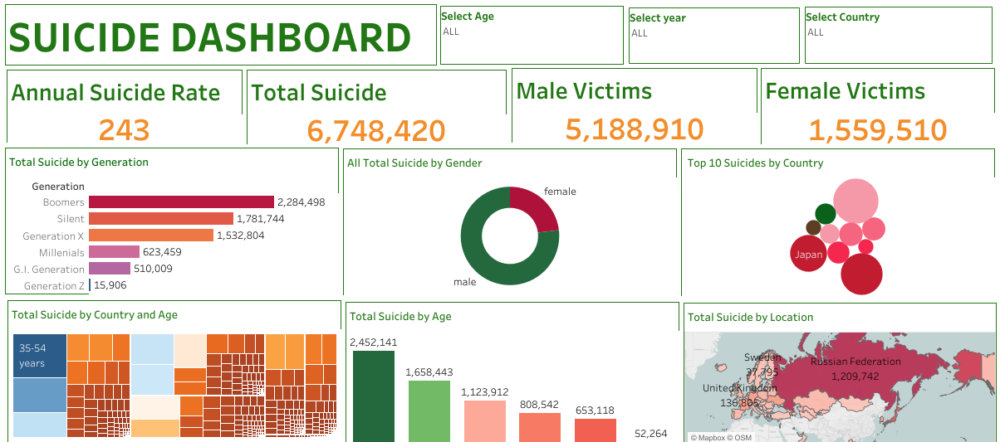

### World-Suicide-Analysis

## Introduction

This analysis is delving into sucide rate in the world. The suicide rate in the world is of global concern. This study is to gain insigt into suicide trends all over the world, among diffrent races, region and age groups. This analysis covered the period of 1985-2016

## Problem Statement 

The Objectives of this analysis is to calculate. 
- Total number of suicide in the period

- Total number number of male suicide victims

- Total number of female victims

- Countries with the highest number of suicide

- Average suicide per year

- Generation with the highest suicide rate

- Age group with the highest suicide rate 

  ## Skills Demostrated

  The following skills are demostrated

  - Excel for data profiling
    
  - Calculated field for KPIs
    
  - Silcers for filtering
    
  - Tableau for data visualization

## Data Sourcing 

This datasets is from www.kaggle.com. it is a csv file with a single table. Its has 12 columns and 27821 rows.

## Data Transformation 
The is a clean data with very few null values with were filtered out. 

## Data modeling 
This is a single sheet therefore data modeling was not carried out.

## Data Analysis and Visualization 

[Click here to view the world suicide dashboard workbook](https://public.tableau.com/app/profile/ussy.page/viz/Suicide_Dashboard/Dashboard1)

- Total number of suicides is 6,748,420 milion during the period covered.

- Total number of male and female suicides are 5,188,910 and 1,559,510 respectively.

- Annual average total number of suicides is 243.

- The boomers generation has the highest suicide rate while generation z has the least suicides rate.

- Rusian has the highest suicides rate followed by United state and Japan.

- The age group of 35-54 has the highest suicide rate while the age group of 5-14 has the least suicide rate.

## Conclusion And Recommendations

 
Improve access to mental health services, including counseling, therapy, and crisis helplines.

Reduce the stigma associated with seeking mental health support to encourage more people to seek help when they need it.

Implement public awareness campaigns to educate the public about mental health issues and reduce stigma.

Introduce mental health education programs in schools to teach students about emotional well-being and coping strategies.
 
Develop and implement routine mental health screenings in schools, workplaces, and healthcare settings.

Provide early intervention programs for individuals at risk of suicide, including those with a history of mental health issues.
 
Implement measures to restrict access to lethal means of suicide, such as firearms, medications, and poisons.

Promote responsible storage of firearms and medications.
 
Identify and provide targeted support for high-risk populations, such as veterans, LGBTQ+ youth, and people with a history of self-harm or suicide attempts.

Address social and economic inequalities that can contribute to suicide risk.
 
Encourage community-based programs that provide social support, reduce isolation, and foster a sense of belonging.

Train community members, teachers, and first responders in recognizing signs of distress and how to intervene.

Develop responsible media reporting guidelines for suicide to avoid sensationalizing or glamorizing it.

Promote responsible portrayal of suicide in the media.

Invest in research to better understand the factors contributing to suicide and to evaluate the effectiveness of prevention strategies.
 
Maintain comprehensive and up-to-date suicide data to inform policy decisions.
 
Fund and promote crisis hotlines and helplines that offer immediate support to individuals in crisis.

Ensure these services are easily accessible and well-publicized.

Encourage businesses to implement mental health programs, including Employee Assistance Programs (EAPs), to support the mental well-being of their employees.
 
Develop and enforce policies that prioritize mental health and suicide prevention.

Support policies that improve access to healthcare, especially for mental health services.
 
Collaborate with other countries to share best practices and strategies for suicide prevention.

  
